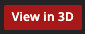

 \
# WoW Model viewer
This library allows eu to generate a character with his customization and stuff.
It is use [Wowhead](https://classic.wowhead.com/) libraries to generate the rendering.
This lib is made to work with WotLK (WOW 3x) but with some little changes it should work
on retail version.

## Requirements
This library requires jQuery 3.x and Wowhead ZamModelViewer to be loaded in your 
html pages. 
```html
    <script src="https://code.jquery.com/jquery-3.5.1.min.js" integrity="sha256-9/aliU8dGd2tb6OSsuzixeV4y/faTqgFtohetphbbj0=" crossorigin="anonymous"></script>
    <script src="https://wow.zamimg.com/modelviewer/live/viewer/viewer.min.js"></script>
```

## Usage
The library can be used either be used in vanilla javascript and framework context

### Framework

With a js framework add the requirements files in your main html file in my Vue.js example this refers to
`public/index.html`

Install the library with:
```bash
npm i wow-model-viewer
```
Import the lib
```js
import {generateModels} from 'wow-model-viewer';
```
In your html add the container of the model.
```html

<div id="model_3d"></div>
```

Call the lib
```JS
const character =  {
    "race":7,
    "gender":1,
    "skin":4,
    "face":0,
    "hairStyle":5,
    "hairColor":5,
    "facialStyle":5,
    "items": [[1,1170],[3,4925],[5,9575],[6,25235],[7,2311],[8,21154],[9,14618],[10,9534],[15,17238],[21,20379],[22,28787]]
};
generateModels(1, `#model_3d`, character);
```
To have more explanation about the `character` json please refer to 
[Advanced usage with items and transmogrification](./README.md)

### Vanilla JS
To load the character my beautiful female gnome warlock
```html
<head>
    <script src="https://code.jquery.com/jquery-3.5.1.min.js"
            integrity="sha256-9/aliU8dGd2tb6OSsuzixeV4y/faTqgFtohetphbbj0="
            crossorigin="anonymous"></script>
    <script src="https://wow.zamimg.com/modelviewer/live/viewer/viewer.min.js"></script>
    <script type="module" src="./index.js"></script>
</head>
<body>
    <div id="model_3d"></div>
</body>
<script type="module">
    import {generateModels} from './index.js';
    const character =  {
        "race":7,
        "gender":1,
        "skin":4,
        "face":0,
        "hairStyle":5,
        "hairColor":5,
        "facialStyle":5,
        "items": [[1,1170],[3,4925],[5,9575],[6,25235],[7,2311],[8,21154],[9,14618],[10,9534],[15,17238],[21,20379],[22,28787]]
    };
    generateModels(1, `#model_3d`, character);
</script>
```
`./index.js` is the js file on the root level of this repository.

To have more explanation about the `character` json please refer to
[Advanced usage with items and transmogrification](./README.md)

### Advanced usage with items and transmogrification

The description of the character is
```json
{
    "race":7,
    "gender":1,
    "skin":4,
    "face":0,
    "hairStyle":5,
    "hairColor":5,
    "facialStyle":5,
    "items": [[1,1170],[3,4925],[5,9575],[6,25235],[7,2311],[8,21154],[9,14618],[10,9534],[15,17238],[21,20379],[22,28787]]
}
```
The `race` number refer to the following values

Race     | Number
:------: | :----:
human    | 1
orc      | 2
dwarf    | 3
nightelf | 4
scourge  | 5
tauren   | 6
gnome    | 7
troll    | 8
bloodelf | 10
draenei  | 11

The items is a 2 dimensional array the inner array contains the following values
`[ slot, display-id ]` the slot is the body part where the stuff is displayed.\
**Don't mismatch `display-id` and `item`** \
Ex for the following item: [Atiesh, Greatstaff of the Guardian](https://www.wowhead.com/item=22632/atiesh-greatstaff-of-the-guardian)
the `display-id` is `193838` to find it inspect. \
 \
For some items a new `display-id` is set for those items a new slot is made.
This library manage those `display-id` so basically you don't care. 


Slot     |      Body       | Is displayed 
:------: |:---------------:|:------------:
1        |      Head       |   Yes        
2        |      Neck       |   No        
3        |    Shoulders    |   Yes        
4        |      Body       |   Yes        
5        |      Chest      |   Yes        
6        |      Waist      |   Yes        
7        |      Legs       |   Yes        
8        |      Feet       |   Yes        
9        |     Wrists      |   Yes        
10       |      Hands      |   Yes        
11       |    Finger 1     |   No        
12       |    Finger 2     |   No        
13       |    Trinket 1    |   No        
14       |    Trinket 2    |   No        
15       |      Back       |   Yes        
16       |    Main Hand    |   Yes        
17       |    Off Hand     |   Yes        
18       |     Ranged      |   Yes        
19       |     Tabard      |   Yes        
20       |   Chest (new)   |   Yes        
21       | Main Hand (new) |   Yes        
22       | Off Hand (new)  |   Yes        

If you need that the library manage the search of the `display-id` based on our
API and take in account player transmogrification you can call it like following
```js

import {findItemsInEquipments, generateModels} from './index.js'
const character =  {
    "race":7,
    "gender":1,
    "skin":4,
    "face":0,
    "hairStyle":5,
    "hairColor":5,
    "facialStyle":5,
}
const equipments = [
    {
        "item": {
                "entry":3075,
                "displayid":15322
            },
        "transmog":{},
        "slot":0
    },{
        "item":{
            "entry":2042,
            "displayid":20379
        },
        "transmog":{
            "entry":22632,
            "displayid":193838
        },
        "slot":15
    }];
findItemsInEquipments(equipments)
    .then(e => {
        character.items = e;
        generateModels(1, `#model_3d`, character);
    });
```
In this case the `display-id` of the `transmog` will always replace the 
`display-id` of the item. **IMPORTANT** in this case the slot will be 
like the previous one `-1` ex Head slot is `0` instead of `1`

### Advertising time
This library was made for [Murloc Village](https://wotlk.murlocvillage.com/).

